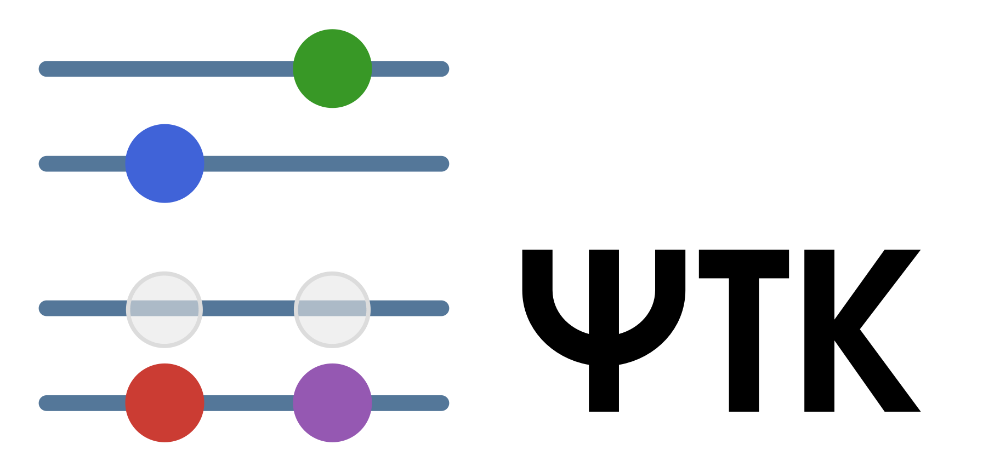

  

# Wavefunction Toolkit

**PsiTK** is a lightweight framework for developing correlated wave function methods in the plane wave basis.

It is built on top of [DFTK.jl](https://github.com/JuliaMolSim/DFTK.jl) and acts as its wavefunction counterpart for post-Hartree Fock and beyond-DFT methods.
It also provides an interface to the high-performance coupled cluster solver [Cc4s](https://gitlab.cc4s.org/cc4s/cc4s).

## Motivation

The complexity of legacy electronic structure codes creates a massive barrier to innovation. PsiTK solves this by minimizing the distance between mathematical intuition and executable code.

Built for readability and rapid prototyping, it bridges the gap between the ground-state machinery and high-performance correlation solvers.
