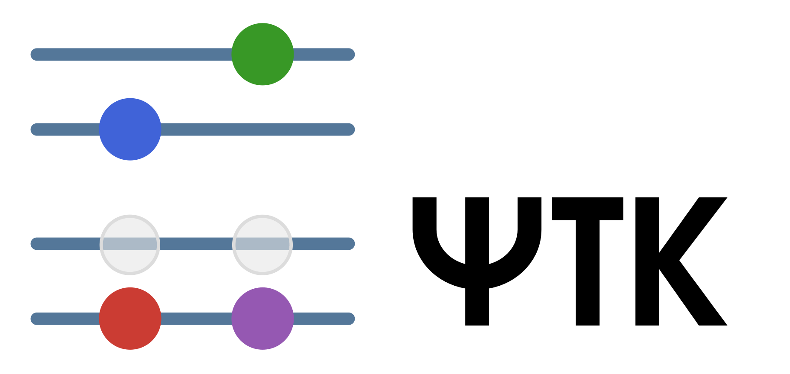

<p align="left">
  
</p>

# PsiTK: A Wavefunction Toolkit

[](https://toschaefer.github.io/PsiTK.jl/dev)
[](https://github.com/toschaefer/PsiTK.jl/actions/workflows/CI.yml?query=branch%3Amain)
[](https://github.com/toschaefer/PsiTK.jl)

**PsiTK** is a lightweight framework for developing correlated wavefunction workflows in the plane wave basis.

Enabling post-Hartree–Fock and beyond-DFT methods for 3D models under periodic boundary conditions, PsiTK acts as the wavefunction counterpart of the [density-functional toolkit (DFTK.jl)](https://github.com/JuliaMolSim/DFTK.jl) and provides an interface to the massively parallel coupled cluster solver [Cc4s](https://gitlab.cc4s.org/cc4s/cc4s).

## Motivation

While established electronic structure codes under periodic boundary conditions (VASP, Quantum Espresso, CP2K, PySCF, ABINIT, GPAW, CASTEP, ...) offer extensive features, their monolithic architectures and accumulated historical complexity often create a high barrier to implementing new ideas.

PsiTK fills this gap by providing a clean, highly optimized, and fast codebase written in Julia. It is designed for quantum chemists and computational materials scientists seeking to bridge the gap between periodic Hartree-Fock and density functional theory and high-accuracy many-body methods. It avoids the heavy structure of massive software packages, allowing researchers to implement and test new ideas quickly, minimizing the distance between scientific intuition and highly performant executable code.

## Development Trajectory

PsiTK is currently under active development. Here's our planned trajectory:

- [x] Resolution-of-identity decomposition (density fitting) of the electron repulsion integrals
- [x] [Cc4s](https://gitlab.cc4s.org/cc4s/cc4s) interface for coupled cluster calculations
- [x] Test suite
- [x] Documentation with examples
- [ ] Natural orbitals
- [ ] MP2 and RPA
- [ ] GPU acceleration 

We welcome input on priorities. Open an issue to discuss.

## Usage

Here is a simple example demonstrating how to run a Hartree-Fock calculation in DFTK, generate Density Specific Virtuals (DSVs) in PsiTK, and dump the correlation tensors for Cc4s:

```julia
using DFTK
using PsiTK
using PseudoPotentialData

# Run standard HF calculation in DFTK (assumes lattice, atoms, positions setup)
model = model_HF(lattice, atoms, positions; exx_kernel=Coulomb(ProbeCharge()))
basis = PlaneWaveBasis(model; Ecut=15, kgrid=[1, 1, 1])
scfres = self_consistent_field(basis)

# Use the occupied subspace only (if needed)
occ_space = extract_occupied_space(OrbitalSpace(scfres))

# Generate Density Specific Virtuals using PsiTK
target = DensitySpecificVirtuals(scfres, occ_space; n_orbitals=50)
dsv_space = generate_orbitals(target, occ_space)

# Dump correlation tensors for Cc4s
active_space = merge_spaces(occ_space, dsv_space)
ΓmnG, G_vectors, kernel_fourier = compute_coulomb_vertex(active_space)

dump_cc4s_files(active_space, ΓmnG, G_vectors, kernel_fourier; folder="cc4s_data")
```

For a fully runnable script, please check out the `examples/` directory.

## Contributing and Support

We welcome contributions from the scientific community! 

- If you encounter a bug, have a feature request, or need help using PsiTK, please open an issue on our [GitHub Issues tracker](https://github.com/toschaefer/PsiTK.jl/issues).
- If you'd like to contribute code, please submit a Pull Request. We recommend opening an issue first to discuss your planned changes.

## Citation

*(Placeholder)* If you use PsiTK in your research, please cite our upcoming JOSS paper.
